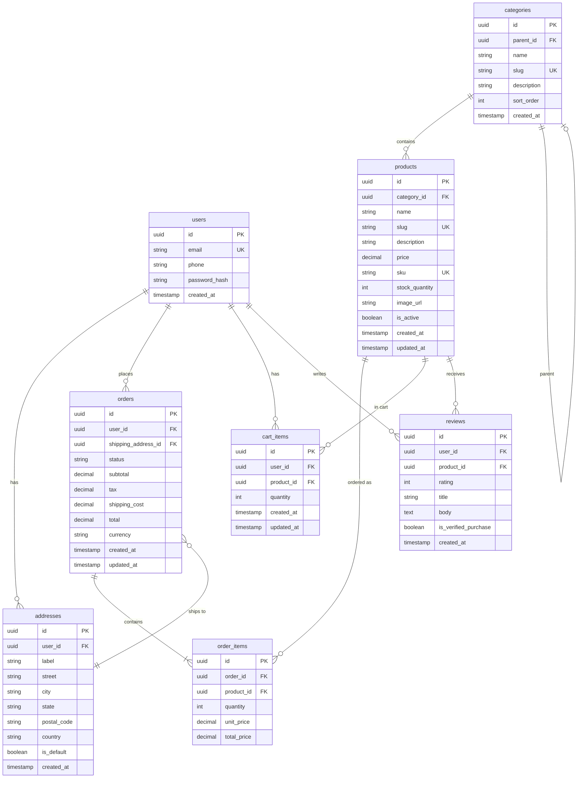

# Golf E-Commerce — Entity Relationship Diagram

High-level data model (Amazon-style e-commerce architecture).

## Visual diagram

A rendered ER diagram image is available at:

**`assets/golf-ecommerce-er-diagram.png`**

---

## How to view the Mermaid source

- **GitHub / GitLab:** Renders Mermaid below automatically.
- **VS Code:** Install extension "Markdown Preview Mermaid Support" and preview this file.
- **Online:** Paste the code block into [mermaid.live](https://mermaid.live).

---

## Mermaid ER diagram

---

## Entity summary

| Entity       | Purpose |
|-------------|---------|
| **users**   | Customer accounts (auth, profile). |
| **addresses** | Shipping/billing addresses per user. |
| **categories** | Product taxonomy (e.g. Clubs, Balls, Bags); supports parent/child. |
| **products** | Catalog (name, price, SKU, stock, category). |
| **orders**  | Customer orders (totals, status, shipping address). |
| **order_items** | Line items (product, quantity, price at order time). |
| **cart_items** | Active shopping cart (user, product, quantity). |
| **reviews** | Product reviews (user, rating, title, body, optional verified purchase). |

---

## Implemented vs planned

- **Implemented:** `users` (see `backend/src/users/user.entity.ts`).
- **Planned:** `addresses`, `categories`, `products`, `orders`, `order_items`, `cart_items`, `reviews` — to be added as you build out the API.
